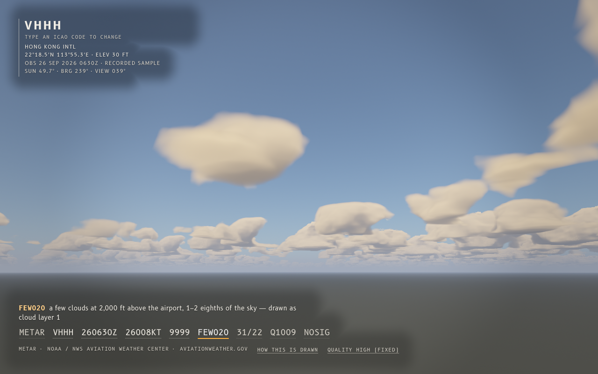

# sky-report

**Type an airport code; see the real current sky, ray-marched from the live weather report.**



sky-report takes a METAR, the standard weather report every airport publishes about twice an hour, and draws the sky it describes. The cloud layers sit at the reported heights and amounts, the haze comes from the reported visibility, the clouds drift with the reported wind, and the sun sits where it really was for that airport at the time of the observation. The raw report stays at the bottom of the screen like a cockpit readout. Point at any group in it and it tells you what the group means and lights up what it drives in the picture.

It is an honest approximation, not a photograph. The page says which parts are data and which are style.

## The 30-second experience

1. Open the page. It shows a recorded sample straight away, then swaps in the live report for the last airport you looked at (Heathrow the first time).
2. Start typing an ICAO code (`KSFO`, `RJTT`, `YSSY` …) anywhere, or tap the sky on a phone. A minimal bar appears. Press Enter.
3. The sky redraws from that airport's latest METAR. The label in the top-left corner, set like an aeronautical chart label, gives the station, its position and elevation, the observation time, and where the sun is.
4. Hover over or tab to a group such as `BKN025` or `27015KT`. A one-line meaning appears ("broken cloud at 2,500 ft above the airport, 5–7 eighths of the sky — drawn as cloud layer 1"), and that layer, the haze or the wind is highlighted in amber in the sky.
5. "How this is drawn" lists, for the current report, every visible element and the group or calculation behind it.

You can also paste a whole METAR into the bar. Twelve recorded reports (from 26 Sep 2026) are bundled, so the page works offline and without the API. They are always labelled RECORDED SAMPLE, never LIVE.

## What is data and what is drawn

| In the sky | Comes from | How |
| --- | --- | --- |
| Cloud layers | `FEW/SCT/BKN/OVC` + base, e.g. `BKN025` | Coverage = the middle of each okta range (1.5, 3.5, 6, 8 eighths), **measured**: seen straight up from below, every style of layer covers that amount to within half an okta (see Tests). The base is the reported height above the airport. Up to four layers are drawn. |
| Cloud style and thickness | height of the base, `CB`/`TCU` | **Style choice.** A METAR does not give thickness or shape. Low FEW/SCT are drawn as heaped cells, low BKN/OVC as a flatter deck, mid-level as a thin layer, high as streaks along the wind, and CB/TCU as tall towers. |
| Haze and fog | visibility (`9999`, `4500`, `1/2SM`, `CAVOK`), `BR`/`HZ`/`FG`/`FU`/…, `VV` | Koschmieder: extinction β = 3.912 ÷ visibility, fading exponentially with height. "10 km or more" style reports are drawn for 3× the floor (30 km). `VV` makes the fog deep enough to hide the sky and lights the scene like a full cloud deck. Deep fog is lit by multiply scattered, grey light, so daytime fog is bright white-grey. Haze and smoke get a warmer tint. |
| Cloud drift | wind (`27015G25KT`, `VRB03KT`, `240V300`, MPS/KMH) | Clouds move toward where the wind blows, at the reported surface speed, in real time. Gusts make the speed pulse. `VRB` uses the middle of a reported sector, or an arbitrary westerly, and says so. |
| Sun | station position + observation time | NOAA's solar position equations (after Meeus). The station position comes from the same upstream API. If the position is unknown, the light is a neutral daylight and no sun disc is drawn. |
| Rain / snow streaks | `-RA`, `+SHRA`, `DZ`, `SN`, … | Intensity from `-`/none/`+`. Vicinity (`VC`) weather is described but not drawn. |
| Stars, ground, view direction, night glow | nothing | **Style choices**, listed on the page: stars are decorative (not a star map), the ground is a plain dark plane seen from about 25 m up, the view faces a low sun or turns away from a high one, and at night low cloud gets a faint warm glow standing in for airport lights. |

Temperature, pressure, runway visual range, trends (`TEMPO`, `BECMG`, `NOSIG`) and remarks (`RMK`) are decoded and explained, but they do not change the picture.

## Why GLSL

The product is a fragment shader (`src/shaders/sky.frag`, WebGL2 / GLSL ES 3.00). For every pixel it:

- integrates **single scattering through a spherical atmosphere** (Rayleigh, Mie and ozone), with a Chapman-style airmass so twilight and the Earth's shadow behave;
- **ray-marches each cloud layer as a volume**, using coarse steps through empty air and fine steps once it touches cloud. At each sample it marches toward the sun for self-shadowing, then applies a two-lobe Henyey–Greenstein phase function, a three-octave multiple-scattering approximation, "powder" darkening, and sky and ground ambient light. Layers above shade the layers below. Clouds stay lit after ground sunset if the sun is still above *their* horizon;
- applies **height-exponential haze** from the visibility, lit by the sun through a forward-scattering phase function. As the haze deepens, a growing share of its light is multiply scattered (the Poisson chance of two or more scatterings, 1 − (1 + τ)e^−τ): that part loses the sky's blue and adds the sunlight that diffuses down through the layer (two-stream transmission), so fog under a VV report is bright white-grey by day;
- adds **stars, the sun disc** (its real 0.53° size, with limb darkening), **precipitation streaks** and the token **highlight**;
- **tone-maps** the result, then limits brightness behind text so words stay readable, and dithers. The dimming is one broad falloff per block of text, anchored to the corner or edge the text sits against and fading out in stops, so it reads as the vignette of a window rather than as cards.

The sky's diffuse light depends only on the sun, so it is computed once per scene in TypeScript (`src/scene/atmosphere.ts`, a port of the shader's own scattering code, with a test that the constants match) and passed in as a uniform, instead of three sky integrals for every pixel.

A second shader (`noise.frag`) builds the 64³ tileable Perlin–Worley noise volume on the GPU, one slice at a time. The TypeScript then histogram-equalises each channel **slice by slice**. That is what makes coverage honest. Once every horizontal plane of the noise is uniform, "keep the top *c* of it" covers exactly a fraction *c* of that plane, and a closed-form CDF maps the blend of two noise channels back to uniform.

A thick layer, seen from below, shows the union of all its planes, which covers more than any one plane (a 6 km `CB` reported as `FEW` used to fill over half the view). So each style has a calibrated threshold (`DRAWN_COVERAGE` in `src/scene/mapping.ts`), found by bisection with a below-view probe (`npm run calibrate`) and checked by the smoke test.

TypeScript is the thin shell: the METAR parser, the sun calculation, the METAR → uniforms mapping, the quality controller and the UI. Every number the shader receives is decided in `src/scene/mapping.ts`, which is unit-tested.

## Quality tiers

| Tier | Render scale | DPR cap | Cloud steps | Light steps | Sky steps |
| --- | --- | --- | --- | --- | --- |
| high | 1.0 | 2 | 64 | 6 | 12 |
| medium | 0.75 | 1.5 | 44 | 5 | 10 |
| low | 0.55 | 1.5 | 30 | 4 | 8 |
| minimal | 0.4 | 1 | 20 | 3 | 6 |

Desktops start on *medium*, and phones and large screens on *low*. With Save-Data on, it starts on *minimal*. The page watches frame intervals in windows of up to 30 frames or 1.5 seconds, whichever comes first, so a slow GPU is judged in seconds:

- it drops a tier whenever the time-weighted median frame is slower than 24 ms, one tier per window, for as long as frames stay slow;
- one isolated long frame (a hitch) per window is ignored, and so are the first frames after the tab becomes visible again; a run of long frames is not a hitch;
- if even *minimal* is slower than 50 ms a frame (under 20 frames a second), it stops animating and draws only when something changes, and the quality label says so ("still: too slow to animate here"). Under SwiftShader, a software GPU at about one second a frame, that took about 15 seconds on the build machine;
- it climbs back up only while frames keep pace with the display's own refresh interval, and only into tiers that have never been too slow, so it cannot oscillate.

The "Quality" button shows the tier and the frames per second **measured on your device**. That rate is capped by the display (60 on a 60 Hz screen), so it says the page is keeping up, not how long a frame takes to render. Clicking the button fixes a tier (and tries animating again). `?q=high` does the same from the URL. `prefers-reduced-motion` freezes the drift and renders only when something changes.

## Build, run, test

Needs **Node ≥ 22.18** (TypeScript runs directly under Node's type stripping for tests). The smoke tests need Google Chrome or Chromium (set `CHROME_PATH` if it is not in a standard place). Wrangler 4 is only needed for `npm run dev` and `npm run dev:pages`; the Pages smoke test uses it when it is installed and is skipped otherwise (set `WRANGLER` if it is not on `PATH`).

```sh
npm ci
npm run build      # → dist/ (index.html, content-hashed JS and CSS, _headers, favicon)
npm test           # typecheck, unit tests, build, then the headless-Chrome smoke tests
npm run dev        # build + wrangler dev: the full app with the live Worker on :8787
npm run dev:pages  # build + wrangler pages dev: the Pages site with its Function, as deployed, on :8788
npm run serve      # static dist/ only, with the production headers; live lookups fall back to samples
npm run shots -- --out /tmp/sky-shots   # screenshots of every sample, desktop and 400 px phone
npm run calibrate  # re-measure DRAWN_COVERAGE (needs a build and Chrome); prints the table
```

Useful URLs: `?id=KSFO` (live), `?sample=YSSY` (recorded), `?metar=METAR%20…` (your own), `&still=1` (freeze, for screenshots), `&q=low` (fix a tier), `&focus=7` (highlight a token), `&probe=below` (test hook: cloud opacity seen straight up over a 120 km square, or `&span=480` km).

### Tests

- **METAR parser** (`tests/unit/metar-parse.test.ts`, 51 tests):
  - real reports, including CAVOK, VV and VV///, variable wind and sectors, gusts, MPS/KMH, statute miles (`1 1/2SM`, `M1/4SM`, `P6SM`, `10SM`), RVR, minimum visibility, missing `///` groups, NIL, trends, remarks and wind shear;
  - graceful failure on junk and oversized input;
  - a fuzz test of 3,000 random token soups;
  - a **cross-check against the Aviation Weather Center's own decoder** on 400 real reports (wind, gusts, visibility, cloud layers, temperature, dew point, pressure).
- **Sun** (`tests/unit/solar.test.ts`, 22 tests):
  - Meeus' *Astronomical Algorithms* worked examples 25.a and 28.b;
  - 12 airport/time cases against **astropy** (IAU SOFA/ERFA), a completely different method, within 0.03° in elevation. The reference script is `tools/sun-reference.py`.
- **Mapping** (`tests/unit/mapping.test.ts`, 34 tests): layers, coverage and its calibration table, layers squeezed too thin to see, drift direction and units, Koschmieder, VV depth, precipitation, time resolution, view, exposure, and uniforms matching the shader's declarations. Every one of the 400 real reports maps without a NaN.
- **Quality controller** (`tests/unit/quality.test.ts`, 19 tests): sustained 300, 500 and 1,000 ms frames step down to *minimal* and then to still mode within seconds; a SwiftShader-like 1,000 → 330 → 140 ms profile ends in still mode; isolated hitches change nothing, a run of long frames does; frames paced at 60 Hz and 120 Hz step back up; a tier that proved too slow is never re-entered.
- **Atmosphere, text dimming, noise** (`atmosphere.test.ts`, `scrim.test.ts`): the TypeScript sky ambient uses the shader's exact constants; every corner of every text block gets the full brightness cap; per-slice equalisation makes every plane uniform.
- **API handler** (`tests/unit/worker.test.ts`, 33 tests), with mocked upstream, an in-memory Cache API and the per-isolate memory cache:
  - validation;
  - cache hit/miss/expiry ("100 views in 5 minutes cost one upstream request"), with the Cache API and, where it is missing, with the memory cache alone;
  - unknown station, upstream 500/429, network failure, malformed and oversized bodies (including an endless stream, cut off at the cap), and timeout.
- **Pages Function** (`tests/unit/pages-function.test.ts`, 5 tests): called the way Pages calls it (`{ request, waitUntil }`), with a mocked upstream and a stand-in Cache API as globals. It answers through the shared handler, writes the cache through `waitUntil`, serves the second view from the Cache API (or, without one, from memory), never sends a bad id upstream, and shares one wiring and one memory cache with the Worker entry.
- **Report/labels/API client** (`tests/unit/report.test.ts`, 22 tests), including "below the horizon" at night, honest wording for squeezed layers, and how the client tells a live report from "no API here" (an HTML page or error page, a network failure), "no report" and upstream trouble.
- **Third-party notices** (`tests/smoke/notices.test.mjs`): `dist/THIRD-PARTY-NOTICES.txt` exists, the page's sources list links to it, and it names every bundled sample station, the recording date, the data's source and terms, and the fonts.
- **Pages** (`tests/smoke/pages.test.mjs`, runs Wrangler locally; nothing is deployed and nothing reaches aviationweather.gov):
  - Wrangler's own Pages Functions build compiles `functions/` and writes a `_routes.json` that sends only `/api/*` to the Function;
  - `wrangler pages dev dist` serves the page with its `_headers`, and answers `/api/*` with the handler's JSON (400 for a bad id, 404, 405), never with the page.
- **Smoke** (`tests/smoke/dist.test.mjs`, headless Chrome over the DevTools protocol):
  - `dist/` loads and draws with WebGL2, with no console errors;
  - hover and keyboard flows (Tab stays inside the "How this is drawn" note and reaches its links), and the offline fallback;
  - **live lookups**, with `/api/metar` answered inside the browser's network layer: a report is drawn and labelled LIVE; an unknown station says so in the bar and leaves the sky alone; an HTML answer (a host with no API) falls back to the recorded sample, labelled RECORDED SAMPLE, with the reason;
  - reduced motion, and the frames-per-second label;
  - a **slow GPU**: under SwiftShader the page steps down to *minimal* and then to still mode, and says so;
  - a true **400 px** viewport through device emulation: no horizontal scroll, and every METAR group (long `RMK` sections too) inside the screen;
  - **touch**: the ICAO bar opens from a tap on the sky and closes with its Close control or a tap outside; the hint says "tap outside" on touch and "Esc" with a keyboard;
  - the served **headers**, merged the way Cloudflare merges `_headers` rules;
  - a **measured WCAG check**: with the text hidden, it screenshots six bright skies (daytime VV fog among them) and reads the pixels behind every text box. The dimmer text colour must reach 4.5:1 against the brightest one;
  - **daytime VV fog** is bright and grey: mean saturation under 0.08 (it was 0.49, sky blue, before) and brightness over 0.75;
  - **cloud cover from below**: 18 reports covering every style and amount, at several heights, measured with the probe (a pixel is cloud when its opacity is over 0.2, over a 480 km square). Each must be within **half an okta (±1/16 of the sky)** of the reported amount. Measured: all within 1 percentage point, e.g. `FEW030CB` 19.2% for a target of 18.75%, `SCT020TCU` 43.9% for 43.75%, `BKN300` 75.0% for 75%.

## The API and the Cloudflare free plan

The page asks its own site for the weather: one endpoint, `GET /api/metar?id=XXXX`, which proxies the public [aviationweather.gov Data API](https://aviationweather.gov/data/api/) (`/api/data/metar?ids=XXXX&format=json`). The handler (`worker/handler.ts`) has no Cloudflare-only types; `worker/runtime.ts` connects it to the platform's `fetch`, the Cache API and a memory cache, and two thin entry points share that wiring:

- **Pages Function** (`functions/api/[[path]].ts`), which the live site uses. `wrangler pages deploy dist`, run from the repo root, uploads `dist/` and bundles `functions/` with it, so the page's same-origin call works on the `pages.dev` address with no other setup.
- **Standalone Worker** (`worker/index.ts` and `wrangler.toml`): the same API, with `dist/` served as Workers static assets, for anyone who would rather deploy a Worker.

What the handler does:

- **Validation:** exactly four letters or digits, starting with a letter. Anything else gets a 400 and never reaches upstream. The page checks the same rule before it asks, so the 400 is a second line of defence.
- **Cache:** two layers, both **5 minutes**, keyed by the normalised station code. "No report for that code" is cached too, so a typo can't hammer upstream.
  - The **Cache API**, shared by every visitor in one data centre (it is not copied between data centres). Cloudflare's documentation says it works for Pages Functions, on a custom domain *or* on `*.pages.dev`, and for Workers on a custom domain or route, but not on `*.workers.dev`. So on the live Pages site it should be in effect. I have only checked Wrangler's local emulation of it: under `wrangler pages dev`, the second request for a station came back `x-cache: HIT` without a second upstream call. That shows the code path, not Cloudflare's production cache. On the deployed site, two requests for the same station should show `x-cache: MISS` and then `HIT`. A `HIT-MEMORY` means the answer came from the memory cache instead.
  - A small **in-memory cache per isolate** (at most 256 stations, about 1 KB each), used when the Cache API has nothing. It needs no setup, but an isolate serves only some of the requests and can be recycled at any time, so it cuts upstream traffic without guaranteeing "one request per five minutes".
- **Size cap:** the upstream body is read as a stream and abandoned as soon as it passes 64 KB.
- **Timeout and errors:** upstream gets 6 s. Errors come back as clear JSON: `invalid_id` (400), `upstream_error` (502, for upstream 5xx/429, bad or oversized bodies, or network failure) and `upstream_timeout` (504). An unknown station is an ordinary answer, `{"error":"unknown_station"}` with status 200, much as upstream itself answers 204 for "no data". That keeps a typo from showing as a failed request in the browser console.
- **Upstream etiquette:** a descriptive User-Agent, as the API docs ask. The API allows 100 requests a minute.

What the page does with the answer (`src/app/api.ts`): a report is drawn and labelled LIVE. Anything that is not the API's JSON (no API on this host, an error page, no connection) means live data is unavailable, and the page draws its recorded sample for that station (or the first sample), labelled RECORDED SAMPLE, and says why. An unknown station is reported in the bar.

**How it fits the free plan.**

- Static files are free and unlimited, and they never run the Function. When Wrangler finds `functions/`, it writes a `_routes.json` that sends only `/api/*` to the Function; a test runs Wrangler's own build and checks that. On the standalone Worker, `run_worker_first = ["/api/*"]` in `wrangler.toml` does the same.
- Function requests count toward the Workers Free plan's 100,000 requests a day, shared with any Workers on the same account. A page view makes one API call, plus one per station typed, and the browser keeps each answer for a minute. That is roughly 50,000–100,000 views a day.
- With the Cache API, upstream traffic is bounded by the cache, not by visitors: at most one request per station per 5 minutes per data centre (288 a day per busy station per data centre), far inside the upstream's 100 a minute. Where only the memory cache applies, expect more upstream requests than that; how many more depends on how Cloudflare spreads requests over isolates, which I have not measured.
- The 10 ms CPU limit counts CPU, not waiting. Per request the handler does a regex check, one or two cache lookups and at most one `fetch`, then parses and re-serialises about 1 KB of JSON; waiting on aviationweather.gov is I/O time. I have not measured CPU time on Cloudflare itself. Locally, under `wrangler pages dev`, a cached answer took about 2 ms of wall time and a fresh one 36–300 ms, almost all of it waiting on upstream.
- When the day's free Function requests run out, Pages either serves static files in place of the Function ("fail open") or returns an error page ("fail closed"), a per-project setting on the Workers Free plan. Either way `/api/metar` stops returning the API's JSON, and the page falls back to its labelled recorded samples. A browser test fakes such an answer (a page instead of JSON), and unit tests cover HTML error pages with error statuses.
- `_headers` applies to static files only: Cloudflare does not apply it to Function responses, so the handler sets its own `Content-Type`, `X-Content-Type-Options: nosniff` and `Cache-Control`. The page's Content-Security-Policy allows the call because it is same-origin (`connect-src 'self'`).
- `_headers` gives the content-hashed `/assets/*` a year-long immutable cache and `/` and `/index.html` `no-cache`. Cloudflare joins the values of every matching rule, so the catch-all `/*` rule carries no `Cache-Control` at all (the local server merges rules the same way, and a test checks the result).

**Deploying.** Run `npm run build`, then, from the repo root (where `functions/` is), `npx wrangler pages deploy dist --project-name <project>` for the Pages site, or `npx wrangler deploy` for the standalone Worker. `wrangler.toml` belongs to the Worker. Wrangler's `pages` commands skip it, because it has no `pages_build_output_dir`, so the Function's compatibility date comes from the Pages project's settings, not from this file. It uses only standard `fetch`, streams and the Cache API, so it should not depend on that date. The owner deploys through a guarded script that pins the right Cloudflare account, so the repo deliberately has no deploy script. `dist/` on any other static host still works: without the API, the page falls back to the recorded samples and says so.

**What I could not check locally.** Nothing here has been deployed by me. The Cache API on `pages.dev`, CPU time, and the fail-open or fail-closed behaviour are all taken from Cloudflare's documentation. Locally I ran the Pages Function and the Worker under Wrangler, with real aviationweather.gov requests for a few stations.

## Privacy

There are no cookies, analytics or accounts. `localStorage` keeps only the last station code, so you come back to it. The browser talks to this site and to Google Fonts (for the B612 typefaces). The API (the Pages Function, or the Worker) talks only to aviationweather.gov.

## Honest limitations

- **Cloud shapes are procedural.** A METAR gives amount and base only; everything about shape, thickness and texture is a model. Coverage is calibrated (equalised noise), but the look of a layer at the horizon is perspective plus noise, not data.
- **The wind is surface wind.** Real clouds move with the wind at their height, which is usually stronger and often from a different direction.
- **The sun is placed for the observation time**, not for "now". A report can be up to an hour old, and the label shows its time.
- **Only four layers are drawn.** Extra layers are listed as not drawn.
- **CB/TCU are tall cumulus.** There are no anvils, lightning or hail shafts, and the tallest (6 km) towers can show some speckle along their edges.
- **Coverage is calibrated from straight below.** Looking across the sky toward the horizon you also see the sides of clouds, so a field of tall towers can look like more than its oktas, as it does to a real observer.
- **Bright fog and overcast need strong dimming behind text.** White text needs a dark background to stay readable, so in a bright white fog the corner and bottom vignettes are heavy.
- **The stars are decorative** and there is no moon, so moonlit nights are drawn dark.
- **Night glow under cloud is assumed** (airport and city lights), not reported.
- **The atmosphere is single scattering plus a rough multiple-scattering term**, so deep twilight colours are approximate.
- **Phones start on a low tier.** A slow GPU gets a softer, lower-resolution sky rather than a stutter.
- **Browser needs:** the sky needs WebGL2. Without it, the report and explanations still work over a plain gradient.

## Next

- A real star map (a public-domain bright-star catalogue placed by sidereal time) and the Moon, with its phase and light.
- Anvils and lightning for CB and TS, and virga under showers.
- Winds aloft from a public forecast model for the drift, clearly labelled as a forecast.
- Blue-noise jitter plus temporal accumulation, for cleaner clouds at the same cost.
- A trend preview: show `TEMPO`/`BECMG` groups as "what might come next".

## Credits

- Weather data: [Aviation Weather Center](https://aviationweather.gov/), NOAA / National Weather Service. Public US-government data. The recorded samples and the test fixture are real reports from that API, fetched on 26 Sep 2026.
- Sun: NOAA Global Monitoring Laboratory's solar position equations, after Jean Meeus, *Astronomical Algorithms*.
- Type: [B612 and B612 Mono](https://fonts.google.com/specimen/B612), the typefaces originally designed for Airbus cockpit displays, loaded from Google Fonts (not shipped in `dist/`). Both are under the SIL Open Font License 1.1.
- Third-party notices: `npm run build` writes `dist/THIRD-PARTY-NOTICES.txt`, linked from the Sources list in "How this is drawn". It covers the 12 recorded METAR samples bundled into the JavaScript (public US-government data from the Aviation Weather Center; terms per the [NWS disclaimer](https://www.weather.gov/disclaimer)). The bundle contains no third-party code: `scripts/notices.mjs` checks esbuild's metafile at build time and would list, with its licence text, any library taken from `node_modules`. esbuild, TypeScript and `@types/node` are build tools only.

Built with AI assistance (Claude).

## License

MIT, see [LICENSE](LICENSE).
